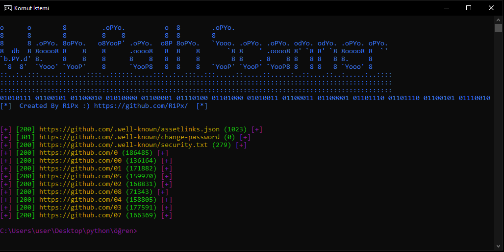

# WebPathBruteR
Yeni Hazırladığım Web Dizin Tarayıcısı...

# Kullanımı
pip install -r requirements.txt 
python3 webbruter.py -u http://target.com/ -w common.txt -t 10 -v

-u = url 
-w = wordlist 
-t = thread 
-v verbose 

